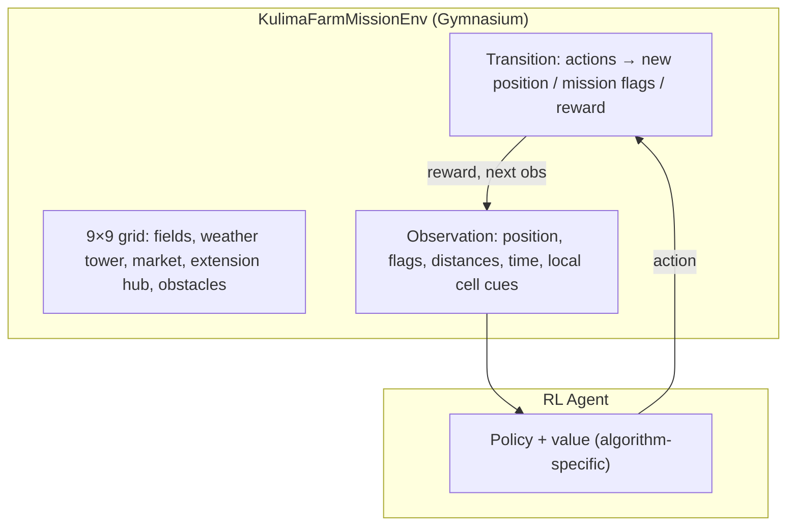

# Agent in Simulated KulimaIQ Mission Environment

## Description

The **agent** is a policy π(a | s) that observes a compact **mission state** derived from the KulimaIQ capstone: smallholder agricultural decision support combining **disease diagnosis**, **climate advisory**, and **market linkage**. The **environment** is a grid world representing a farm sector in Rwanda (Byumba metaphor): **extension hub**, **diseased field**, **weather tower**, and **market**. The agent must navigate and execute **mission actions** (move, diagnose, fetch climate, post listing) to maximize **cumulative reward** while avoiding wasted steps and invalid tool use.

## Diagram (Mermaid)

## Interaction loop

1. **Start state:** agent at **extension hub**; mission flags `diagnosed`, `climate`, `market` false.  
2. **Each step:** agent selects one of nine **discrete actions** (wait, move×4, diagnose, climate, market, extension consult).  
3. **Rewards:** positive for completing each mission objective on the correct tile; penalties for invalid actions, collisions, and time; **bonus** when all three objectives are complete.  
4. **Terminal:** success (all objectives) or **timeout** at `max_steps`.

## Algorithms compared

| Algorithm        | Family          | SB3 / custom        |
|-----------------|-----------------|---------------------|
| DQN             | Value-based     | Stable-Baselines3   |
| REINFORCE       | Policy gradient | Custom (PyTorch)    |
| PPO             | Actor–critic    | Stable-Baselines3   |
| A2C             | Actor–critic    | Stable-Baselines3   |

All agents share the **same** `KulimaFarmMissionEnv` for **fair comparison**.
